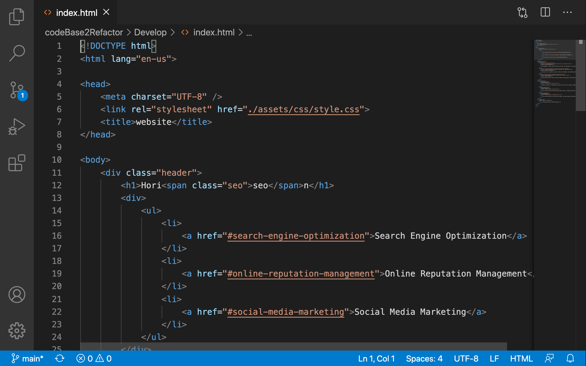
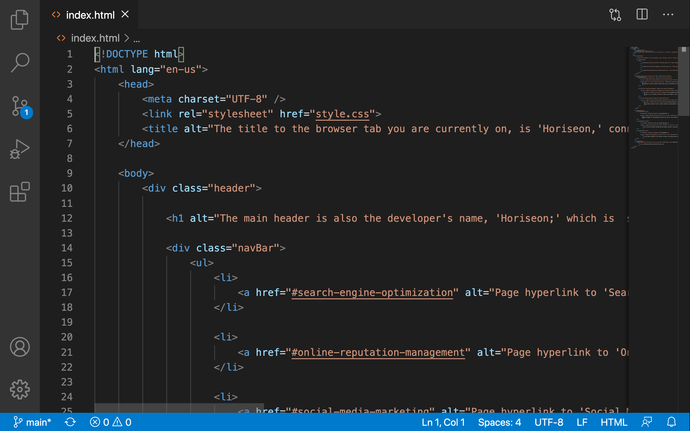
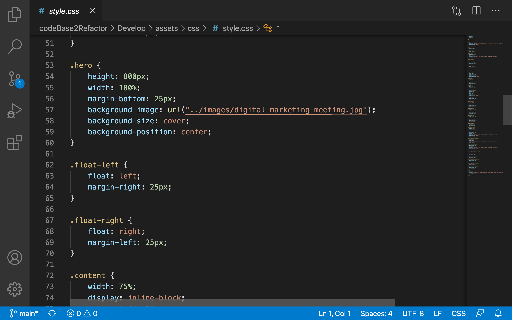
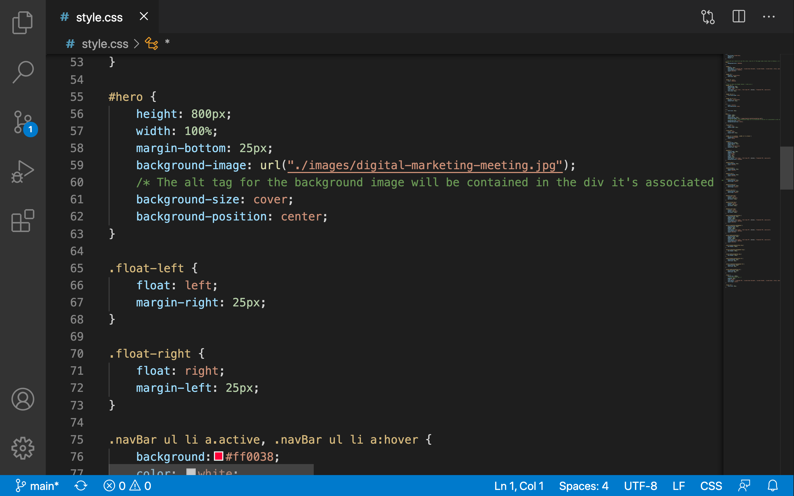

# Repository: codeRefactored
#### © 2020-Present All Rights Reserved.  codeRefactored® is a registered trademark of Super Coding Ninja™  All material must be cited or credited, when using material (free to use).

## Table of Contents
* [Repository Description](#Repository-Description)
* [User Story](#User-Story)
    * [Marketing Agency](#Let's-visualize-ourselves-as-the-marketing-agency-that-hired-our-firm)
    * [End User](#Let's-visualize-ourselves-as-parties-who-may-require-certain-accessibilty-standards-to-be-met)
    * [Developer](Let's-visualize-ourselves-DEVELOPERS)
* [Installation](#Developers-For-GitHub-Repository-Purposes-Installation-and-best-Practices)
    * [Refactoring the Codebase](#Refactored-Codebase-Goal(s)-Accomplished/What-is-the-Mocked-Marketing-Client's-Acceptance-Criterea-for-our-Refactored-Code-Suggested)
    * [Checking a Website's Accessibilty](#Checking-a-Website's-Accessibilty)
    * [Common Mistakes You Can Avoid (Recap)](#Common-Mistakes-You-Can-Avoid-Recap)
* [Overview: Changes Made](#Overview-Changes-Made)
    * [Workflow](#Workflow)
    * [Screenshots](#Screenshots)
    * [HTML Refactored](#HTML)
    * [CSS Refactored](#CSS)
* [Repositiory End-Goal Criterea](#Refactored-Codebase-Goal(s)-Accomplished/What-is-the-Mocked-Marketing-Client's-Acceptance-Criterea-for-our-Refactored-Code-Suggested)
* [Future Project](#Future-Project)

Learn why it is vital to make a website accessible; and even better, how to make it accessible!  There's no absolute way to code; so, when I say learn how to make a website more accessible, you're going to know a few things that you should be looking for, and what you, the Developer, or your client(s) should be incorporating in your/their website(s).  I hope you enjoy the repository, below (I really had a lot of fun creating this project).  Please feel free to fork and even collaborate with me on this awesome repository!  Thank you for viewing! - Frederick Thomas, [Super Coding Ninja™](https://github.com/supercodingninja)

## Repository Description
I am learning that some of the more difficult and common tasks for  both, front-end and junior developers, are to refactor existing code.  When I say "refactor," this is to improve the code (codebase) provided, without changing what it does; or meeting a certain set of standards, or implementing new technology.  A practice I adopted, and I believe is a common courtesy to bestow unto others, is when one party working with another party's code, incorporate "The Scout Rule."  The Scout Rule is really a recommendation, stating to always leave the code given to you to refactor, cleaner than when you found it. "CLEAN UP SOMEONE ELSE'S MESS,"  You may/maynot be thinking; but that is not the way that I suggest you think.  A good way you can impress your clients is going the extra mile:  improve any/all codebase(s) for long-term sustainability, etc.; i. e. ensure all links are functioning, correctly.  Have you ever considered reworking the CSS: to make it more efficient (you could do achieve this by consolidating CSS selectors and properties).  Does your codebase, which you refactor, follow the semantic structure of the HTML elements?  Have you ever considered including comments before each element/section of the page?  If you can refactor code, and everyone should be able to extend courtesy for their fellow person/temmate/client; then you are on your way to a successful career: so long as you keep learning, and applying what you learn.  In this repository, I will mimic what it's like to have a marketing agency hire our firm; and ask us to refactor their existing site- IT'S ALREADY ESTABLISHED- they just need us to make it more accessible. 

As developers, we Must make web accessibility an important consideration for businesses we develop for.  By doing so, it will ensure that all people (disable or not) can access a website: because anyone not able to access a site, is another potential customer loss, revenue not gain; and not to mention litigation that can occur when people, who have with disabilities, cannot access a website the business hired YOU to develop/refactor (#FACT).  Plus, the more accessible sites are better positioned in search engines (Bing, Google, Yahoo!, Baidu, Yandex, Ask.com, and DuckDuckGo are only  a few).  Search Engine Optimization (SEO) is everything and every bit of a necessary survival element EVERY business  or organization needs- it's vital; so it is with an assessible website.  Just as some people may/may not wear glasses to read, some people use assistive technologies (video captions, screen readers, braille keyboards, etc.) in their day to to day operations.  When you, the developer, make a website more accessible, you not only enable an organization to succeed, you enable the user, who needs a site to have certain functions, the ability to operate as their fellow person; which makes them feel like a complete person, not forgotten or less valued.  Remember this, as a developer, your goal should be designing experiences that makes people's lives simple; because as developers, we solve problems that people didn't even knew they had, even better, in a way that they did not understand: We are the super heroes and heriones of tomorrow; so get coding, and I hope this repository helps you along your development. - [Frederick Thomas](https://www.linkedin.com/in/discoverfrederickthomas/), Super Coding Ninja™

## User Story
### Let's visualize ourselves as the marketing agency that hired our firm:
    1.   We want our codebase to follow current accessibility standards (ARIA).
    2.   We want our codebase to be an optimumal level, to where our site best optimized, is reached by most, if not all search engines.
    3.   We want to avoid discrimination; and legal litigation/complications.
    4.   We want to ensure that we have and keep positive relations (public and private sectors).
    5.   We want to broaden/deepen our market pentetration.
    6.   We want to differentiate ourselves from our competitiors.
    7.   We want to drive innovation; and not fall behind the times.
    8.   We want to enhance our brand.

### Let's visualize ourselves as parties, who may require certain accessibilty standards to be met:
    1.   We need the site to be keyboard friendly.
    2.   We need all the content, not just some of the content, to be easily and readily accessible.
    3.   We need alternative text available.
    4.   We need clear contrast between the colors of the elements, of a website; since everyone's spectrum perception is different.
    5.   We need headers structuring the content of a website; and they have to be done so, correctly.
    6.   We need the form fields to be clearly labeled.
    7.   We need only tabular data to be simple, not complex.
    8.   We need to be able to adjust the text or font size; and the website does not break/render itself useless (especially from our original purpose).
    9.   We need to be able to choose whether we desire automatic navigation or media.
    10. We need the contents of a website to be clearly, descriptive, flow easily; and unique headers and links, etc.

### Let's visualize ourselves, **DEVELOPERS**:
    1.   We need to ensure all links all function, correctly; and USE DESCRIPTIVE ANCHORED TEXT, not "click here."
    2.   We need to ensure all CSS selectors and properties are consolidated and organized to follow semantic structure.
    3.   We need to ensure the .css file is properly commented; especially since we are already simplifying the workflow/folder(s) directories structure.
    4.   We need to ensure the website's url is still deployable.  [Can we deploy our reposotitory url live].
    5.   We need to ensure our refactored code loads with no errors.
    6.   We need to enhance the codebase, not utterly change the code without permission: it's good to keep the original codebase given, in another location; and copy that file, prior to refactoring the codebase.  Let's resemble at least 90% of the demo file provided (relative path: codeBase2Refactor/Assets/demo.png).
    7.   We need to follow best practices for file structure, and naming conventions.
    8.   We need to follow best practices for class/id naming conventions, indentation, quality comments, etc.
    9.   We may want to consider:
            a.  Using Alt tags.
            b.  Create subtitles and transcripts for media
            c.  Ensure that we place periods at the end of our abbreviations.
            d.  Using descriptive and unique links.
            e.  Contrasting colors, cleary, from the color spectrum: everyone's percepetion is different, not absolute (be kind, and don't use "50 Shades of Grey").
            f.   Use larger and wider buttons: make them more able to click, by the end user (whether disable or not, make it accessible).
            g.  Simplicity of the content: NO ONE [tongue in cheek] likes reading a block of code, without character; and linearization (make a topic, paragraph, or an "About Us" section, but do NOT cluster any website).
            h.  INCLUDE AN ACCESSIBILTY GUIDE (what if a standard was forgotten, or more standards ar added).  THIS IS GOING TE EXTRA MILE FOR YOUR CLIENT(S), etc.; because thy will not have to research what accessibilty standrads are implemeted; and they will know what standards are not inclueded in their website- and so will the end users!
            i.   Researching/Getting to know the targeted audience: is our Marketing Agency more focus on a certain set of disabilties; i. e. products gear more for the blid than hearing impaired, etc.
            j.   Identifiable/proper use of HTML headers (think semantics).
            k.  Keyboard Accessibilty
            l.   Image(s) Accessibilty
            m. Creating menus, forms, and tables; while keeping all accessible and simple.
            n.  HIGHLY SUGGEST incorporating the ARIA for Web Applications ( “Accessible Rich Internet Applications”). [Ref.: https://www.washington.edu/accessibility/web/landmarks/]
            o.  Test your page with a screen reader (ChromeVox and Fire Vox can be added to your browser extension, quickly).
            p.  Checking your refactored code with a tool bar ( Firefox has one called, "Accessibility Evaluation Toolbar"; and if you remembered Opera Browser (still popular in other parts of the world), they have one called, "Web Accessibility Toolbar").
            q.  Check your refactored code with a Web-Based Checker; such as "Wave" (https://wave.webaim.org/).

## Developers: For GitHub Repository Purposes (Installation, and best Practices)
    1.   Please fork my repository.  It's a good idea to make sure you have a unique name for your repositiory.  It's advised that your repositroy contains multiple descriptive commit messages (this is how you and other developers can track why you/others were committing any changes made: creates more time for action, and less thought on researching prior work- move forward, not backwards).
    2.   Clone my repository; and open the IDE o your choice.
    3.   It's highly suggested that your repository contains a quality README file (with description, screenshot, and link to deployed application).

### Refactored Codebase Goal(s) Accomplished/What is the Mocked Marketing Client's Acceptance Criterea for our Refactored Code Suggested
    We will know our refactor codebase is most likely to be accpeted by our Mocked Marketing Agency Client if:
    1.   Our webpage meets accessibility standards.
    2.   Other Developers can see semantic HTML elements, when viewing the source code.
    3.   When other Developers view the structure of the HTML elements, they will then find elements follow a logical structure independent of styling and positioning.
    4.   When other Developers view the image elements, they will find accessible alt attributes.
    5.   When other Developers view the heading attributes, they will find that they fall in sequential order.
    6.   When other Developers view the title element, they will find a concised and descriptive title.

### Checking a Website's Accessibilty
    Listed below are a few references; which can possibly assist you in checking a website's accessibility.
    1.   The University of Washington has a great quick reference checklist on assurring a website is accessible: [https://www.washington.edu/accessibility/web/]
    2.   North Carolina State University has great visual and cose source examples, etc. [https://accessibility.oit.ncsu.edu/it-accessibility-at-nc-state/developers/accessibility-handbook/mouse-and-keyboard-events/links/all-links-must-contain-either-text-or-an-image-with-alt-text/#:~:text=In%20order%20for%20a%20link,describing%20where%20the%20link%20goes.&text=However%2C%20it%20is%20alright%20to,conjunction%20with%20an%20alt%20attribute.]
    3.  "WAVE Web Accessibility Evaluation Tool" is a web accessbilty tool, from Pope Tech (enterprise system based on Wave). [https://wave.webaim.org/]

### Common Mistakes You Can Avoid (Recap)
    Reference Link: [https://www.voices.com/blog/website-accessible/]
    Listed below, are common mistakes many developers made thorughout their caeers.  You can avoid some of these mistakes; and create a more vibrant experiences throughout your career.
    1.   Heading tags are improperly used (THINK SEMANTICS)
    2.   Lack of ARIA implemented
    3.   When making a paragraph for the alt text, do not make the paragraph too, long.
    4.   Use original work, or non-copyrighted material- and if you are using material that open source, please give the file a new name; rather than the long file name usually associated with a file, that is downloaded/copied from a search engine, like Google, bing, or Yahoo!
    5.   Do not focus on describing graphic designs of charts, tables, graphs, etc.  Focus more on describing the data stored, all main ponits and relations within the data.  You do not want someone saying, "That chart sounds beautiful- what's it about?"
    6.   Heavy use of ARIA vocabulary (this will create latency, and NO ONE [tongue in cheek] likes a lagging experience).
    7.   As far as accessibility purposes goes, if it has not been tested by ARIA; then it's probably not a good idea to implement (each organization will have to make that determination of their own).
    8.   Use ARIA specifications, correctly (no shortcuts).
    9.   Leaving you with my personal favorite: PSEUDO-CODE! + Commit your git with Comments!  This is where you can dictate what you were thinking, at the time you wrote your own code; or refactored someone else's code.  Again, and finally, NO ONE [tongue in cheek: always someone ;-) ] likes trying to figure out what another person was trying to do: when you code or refactor a codebase, write clean, structure, and efficient code, and Pseudo-code (explaining what it is you are trying to do).

## Overview: Changes Made
### Workflow
    1. Created a better worklfow:
        a. separated codebase directory from code refactored directory.
        b. Reduced folders needed (only one .html and .css file present).
    2. User story and Acceptance Critera added.
    3. Quick reference links added to ReadMe.md file.
    4. MAJOR CORRECTIONS, and SIMPLIFICATIONS: peer code review with colleagues.
    5. Restructured ReadMe.md file.
    6. Tested local machine URL, and GitHub Repository (simulating test for Client).
    7. Published Live URL to Repository (simulating Client accepted refactored code).

### Screenshots
#### Codebase: HTML 
#### Recfactored: HTML 
#### Codebase: CSS 
#### Refactored: CSS 

### HTML
    1. Created .html file for refactored code.
    2. Proper indentions made; and <h3> Ln 33 made into <h1>
    3. Discovered Ln 13 to 27 was incorrect on semantics: after the <ul> tag, it should have been the  tag; and enclosed between  tag, should have been <li></li>. By correcting this error, the hyperlinks desired to direct viewers to other parts of te page, became functional.
    4. Researched why "Search Engine Optimization" was not funtioning: I discovered semantic issues when Ln 32 was labeled as a class only, and not 
, ec. This created more issues with possibly HTML and CSS in lines 32-56.
    5. Tested and found that all page links were functional; however, semantic issues were discovered and corrected. CSS issues are now, apparent. It is necessary to fully review syntax structure and semantics.
    6. "Text Only" .html and button added.
    7. Semantic issue noticed in <ul> to navigation. A new class was also created to enable suggested features: this enables modifications via .css file a little easier.
    8. navBar adjustments; and button label changed.
    9. Corrections to links, and simple semantics were implemented.
    10. Removed textOnly.html: unnecessary, once Alt tags, and other accessiblity requirements were made.
    11. Implementated of alt tags.
    12. Made correction: the alt attribute for the background image in the CSS file must be indicated in the html tag it's associated to. REFACTORING COMPLETED!!!
    13. Tested refactored .html file: PASSED.
    14. Published Live URL!

### CSS
    1. Created .css file for refactored code.
    2. Discovered and changed any semantic and syntax issues; i. e. Ln 55 had an ID "hero," labeled first, as a class, "hero."
    3. Researched why "Search Engine Optimization" was not funtioning: I discovered semantic issues when Ln 32 was labeled as a class only, and not 
, ec. This created more issues with possibly HTML and CSS in lines 32-56.
    4. Added a margin-top to ln 74, in order to temporarily fix style issue discovered when links were corrected.
    5. Semantic issue noticed in <ul> to navigation; and modifications were made.
    6. navBar adjustments; and button label changed.
    7. Corrections to links, and simple semantics were implemented.
    8. Made correction: the alt attribute for the background image in the CSS file must be indicated in the html tag it's associated to. REFACTORING COMPLETED!!!
    9. Tested refactored .css file: PASSED.
    10. Published Live URL!

## Future Project
In the development of this [repository](https://github.com/supercodingninja/codeRefactored) (repo), during a peer code review, a colleague introduced me to this [Markdown Cheatsheet](https://github.com/adam-p/markdown-here/wiki/Markdown-Cheatsheet), created by [Adam Pritchard](https://github.com/adam-p).  It phenomiallly assisted me on making my headers, and content structure.  I had structure flow; but I honestly did not know how to do a proper markdown in my ReadMe.md file.  Gratitude to my colleague, Marlon, for introducing me to this great repository!  You can actually dive deeper into mark down, and learn even greater details from [John Gruber](https://daringfireball.net/projects/markdown/); and of course, you can awlays refer to [GitHub](https://docs.github.com/en/free-pro-team@latest/github/writing-on-github).  I decided to fork Adam-P's repo, and see if I could make a few suggestions of my own!  I hope to collaborate with this developer, on his project; or at the very, least, build from his project (as others have) making personal improvements of my own: to at the very least, assist myself in my own career and adventures as a Developer (you have to keep coding and trying new ideas).  Feel free to join and collaborate with [me](https://github.com/supercodingninja/markdown-here)!  I hope you enjoyed my repo!  I really had a lot of fun creating it.  Please feel free to fork and even collaborate with me on this awesome [repository](https://github.com/supercodingninja/codeRefactored).  Thank you for viewing! - Frederick Thomas, Super Coding Ninja™ [2014-Present](https://supercodingninja.github.io/) All Rights Reserved
